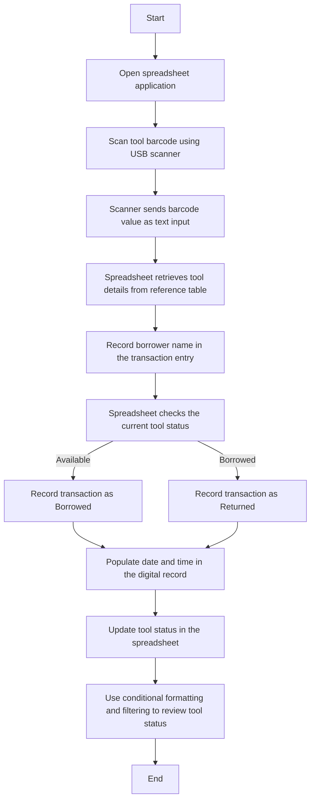

# Laboratory Tracking System User Flow

This document describes the user flow of the Laboratory Tracking System based on the prototype presented in the thesis *Design of a Low-Cost Tool Accountability System for Electrical Laboratories Using Barcodes*. The flow is limited to the functions explicitly described in the study.

## 1. Scope Basis

The flow is based on these thesis-supported system characteristics:

- selected commonly used electrical laboratory tools are identified and prepared for tracking
- each selected tool is assigned a unique barcode label
- a low-cost handheld barcode scanner is connected to a computer through USB
- scanned barcode values are received by a spreadsheet application as text input
- the spreadsheet uses a reference table, lookup functions, formulas, and logical rules
- the transaction record includes borrower name, date, time, and borrowing or returning status
- conditional formatting and filtering are used to monitor borrowed, available, missing, or unreturned tools

The following are outside the scope of the documented prototype:

- wireless tracking
- real-time location monitoring
- automated notifications
- integration with online databases
- RFID
- mobile applications
- biometric systems

## 2. Primary Actors

- **Laboratory Staff / Laboratory Personnel**: prepares tools for the system, scans barcodes, records borrower details, and reviews tool records.
- **Laboratory Instructor**: monitors tool status and reviews accountability records.
- **Student Borrower**: borrows and returns tools during laboratory activities.

## 3. Main System Elements

- **Barcode-Labeled Tool**: the physical laboratory tool with an attached barcode label.
- **USB Barcode Scanner**: the low-cost handheld scanner used to read the tool barcode.
- **Computer with Spreadsheet Application**: the main processing and storage environment of the prototype.
- **Reference Table**: the spreadsheet table that stores tool barcode values, descriptions, and current status.
- **Transaction Record / Digital Log**: the spreadsheet record where borrower name, date, time, and status are stored.
- **Spreadsheet Monitoring View**: the spreadsheet area where conditional formatting and filtering help staff review tool status.

## 4. Preconditions

Before normal operation begins, the following conditions should already be true:

- the selected laboratory tool has been identified for inclusion in the system
- the tool has a unique barcode linked to its spreadsheet record
- the barcode label has been printed and attached to the physical tool
- the scanner is connected to the computer through USB
- the spreadsheet application is open and ready to receive scanned input

## 5. High-Level System Flow

## 6. Detailed User Flow

### 6.1 Tool Preparation and Barcode Labeling Flow

This flow happens before a tool can be tracked in daily laboratory use.

1. Laboratory staff identifies the commonly used electrical laboratory tools to be included in the prototype.
2. A spreadsheet reference record is created for each selected tool.
3. Each tool is assigned a unique barcode value.
4. Barcode labels are generated using free barcode generation software.
5. The labels are printed using standard printers.
6. The printed barcode labels are attached to the physical tools.

**Result:** Each selected tool is ready to be tracked through barcode scanning.

### 6.2 Borrowing or Returning Transaction Flow

This is the main operational flow of the prototype.

1. The operator opens the spreadsheet application on the computer.
2. The operator scans the tool barcode using the handheld USB barcode scanner.
3. The scanner sends the decoded barcode value to the computer as text input.
4. The spreadsheet receives the scanned value.
5. Lookup functions retrieve the tool details from the reference table.
6. The borrower name is recorded in the transaction entry.
7. Spreadsheet functions populate the date and time fields.
8. Spreadsheet logic checks the current tool status.
9. If the tool is `Available`, the transaction is recorded as `Borrowed`.
10. If the tool is already marked as borrowed, scanning the same barcode again records the `Return`.
11. The current tool status in the spreadsheet is updated based on the transaction.

**Result:** The tool movement is recorded digitally, and the current status is updated in the spreadsheet.

### 6.3 Status Monitoring Flow

This flow supports daily monitoring of tools in use.

1. Laboratory staff or instructors review the spreadsheet records.
2. Conditional formatting visually indicates borrowed and available tools.
3. Staff check the current status of tools at a glance using the spreadsheet view.

**Result:** Staff can quickly see which tools are currently available and which are out for use.

### 6.4 Missing or Unreturned Tool Review Flow

This flow supports accountability for tools that are still out.

1. Laboratory staff filters spreadsheet records using status and date.
2. Tools that remain marked as borrowed are identified for review.
3. Staff check the related transaction record to determine responsibility for the unreturned tool.
4. Overdue or not yet returned tools can be reviewed for follow-up.

**Result:** Missing or unreturned tools can be identified using spreadsheet filtering and stored transaction records.

### 6.5 Record Review Flow

This flow supports review of recorded tool activity.

1. Laboratory staff or instructors open the spreadsheet records.
2. Staff review stored tool transactions and current status information.
3. Spreadsheet records are used to support accountability and tool monitoring during laboratory operations.

**Result:** Tool records remain accessible for checking borrowing and returning activity.

## 7. Supporting and Exception Flows

### 7.1 Duplicate or Incorrect Entry Handling

1. A transaction or record contains a duplicate or incorrect entry.
2. Simple spreadsheet validation mechanisms help detect the issue.
3. Laboratory staff reviews the affected tool record or transaction entry.
4. The record is corrected within the spreadsheet.

**Outcome:** Record accuracy is supported through simple spreadsheet-based validation.

### 7.2 Damaged Barcode Label Handling

1. A tool barcode label becomes damaged or unreadable.
2. Laboratory staff identifies the tool from its existing spreadsheet record.
3. A replacement barcode label is generated and printed.
4. The replacement label is attached to the tool.

**Outcome:** The tool remains linked to its existing digital identity and can continue to be tracked.

## 8. Flow Accuracy Notes

This revised flow is aligned with the thesis description of the prototype:

- tool preparation is limited to selected commonly used electrical laboratory tools
- tool tracking is based on unique barcode labels
- the scanner operates through USB and sends barcode data as text input
- the spreadsheet serves as the main processing and storage environment
- status logic depends on the current tool status in the spreadsheet
- monitoring depends on conditional formatting and filtering rather than advanced software features

## 9. Summary

The thesis-supported system flow begins with preparing selected tools and attaching barcode labels, then uses a USB barcode scanner and spreadsheet application to record borrowing and returning activities. The spreadsheet retrieves tool details, records borrower name with date and time, checks the current status of the tool, updates the transaction, and supports accountability through conditional formatting and filtering of unreturned tools.
